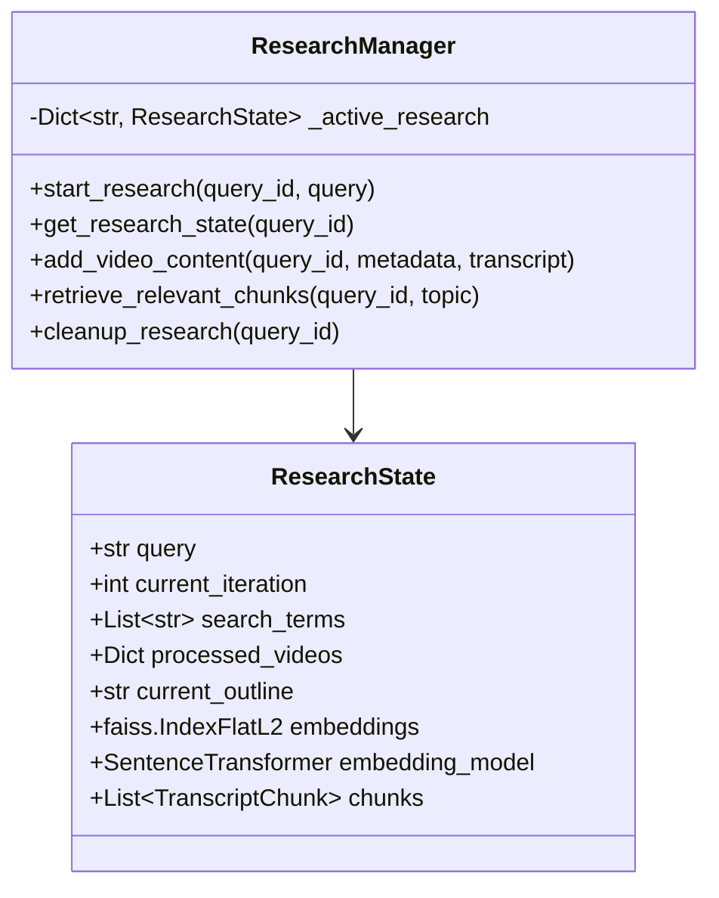
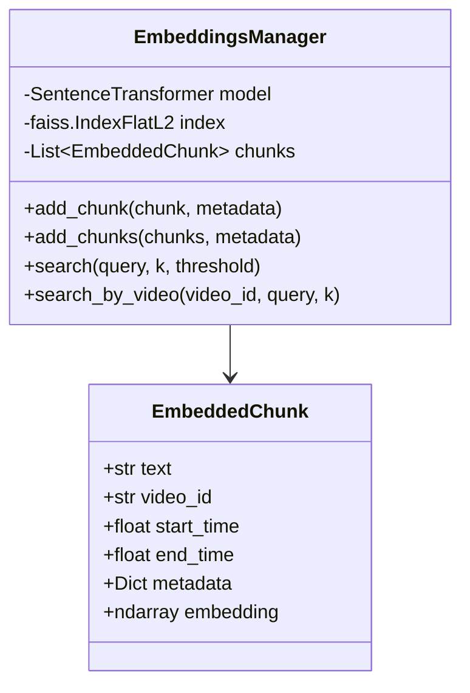
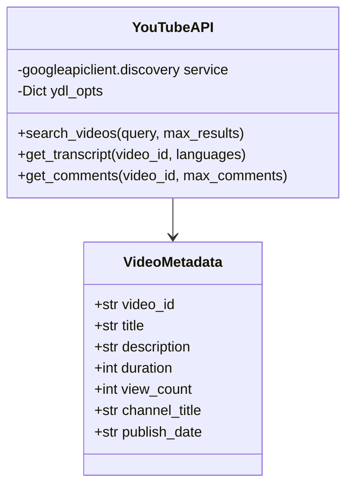
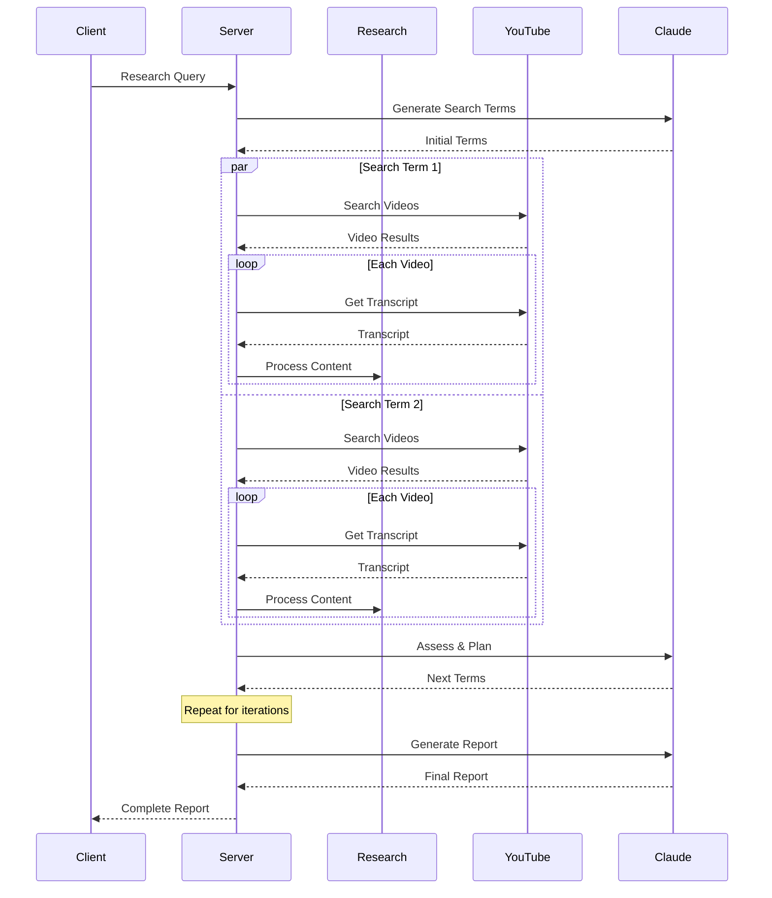

# Developer Documentation

This document provides technical details for developers working on or maintaining the YouTube Research MCP Server.

## System Architecture

### Core Components

#### 1. Research Manager (`core/research.py`)


The Research Manager maintains session state and coordinates the research process. Key considerations:
- Each research query gets a unique ID and isolated state
- Memory management through cleanup after completion
- Thread-safe state management for async operations

#### 2. Embedding System (`core/embeddings.py`)


The Embedding System handles:
- Semantic search using FAISS
- Efficient batch processing
- Memory-based storage (no persistence)
- Configurable similarity thresholds

#### 3. YouTube Integration (`core/youtube_api.py`)


API Interaction Patterns:
- Async operations for all API calls
- Rate limiting and backoff
- Error handling and logging
- Metadata enrichment

### Async Flow



## Implementation Details

### 1. Transcript Processing

```python
# Example of efficient transcript chunking
chunks = []
current_chunk = []
current_length = 0

for segment in transcript:
    current_chunk.append(segment)
    current_length += len(segment.text.split())
    
    if current_length >= target_length:
        # Process chunk with overlap
        overlap_tokens = current_chunk[-overlap_size:]
        chunks.append(create_chunk(current_chunk))
        current_chunk = overlap_tokens
        current_length = sum(len(s.text.split()) for s in overlap_tokens)
```

Key considerations:
- Maintain video timing information
- Handle overlap properly
- Clean text artifacts
- Preserve metadata

### 2. Embedding Management

```python
# Example of batch embedding
async def batch_embed(self, texts: List[str], batch_size: int = 32):
    embeddings = []
    for i in range(0, len(texts), batch_size):
        batch = texts[i:i + batch_size]
        batch_embeddings = self.model.encode(batch)
        embeddings.extend(batch_embeddings)
    return embeddings
```

Performance optimizations:
- Batch processing for efficiency
- Memory management for large collections
- Index optimization
- Similarity threshold tuning

### 3. Claude Integration

The system uses two different Claude models optimized for different tasks:

```python
# Haiku configuration for iterative assessment
HAIKU_CONFIG = {
    "modelPreferences": {
        "hints": [{"name": "claude-3-haiku"}],
        "speedPriority": 0.8,
        "costPriority": 0.7
    }
}

# Sonnet configuration for final report
SONNET_CONFIG = {
    "modelPreferences": {
        "hints": [{"name": "claude-3-sonnet"}],
        "intelligencePriority": 0.9
    }
}
```

Prompt design patterns:
- Clear instruction formatting
- Consistent JSON response structures
- Error handling for parsing
- Context management

## Extension Points

### 1. Adding New Research Features

To add a new research capability:

1. Add new feature class in core/:
```python
class NewFeature:
    def __init__(self):
        self.state = {}
    
    async def process(self, data):
        # Implementation
```

2. Register with ResearchManager:
```python
class ResearchManager:
    def __init__(self):
        self.features = []
    
    def register_feature(self, feature):
        self.features.append(feature)
```

### 2. Custom Embeddings

To implement a different embedding system:

1. Create new embeddings class:
```python
class CustomEmbeddings:
    def __init__(self):
        self.model = load_custom_model()
    
    async def embed(self, text):
        # Implementation
```

2. Update EmbeddingsManager configuration:
```python
embeddings_manager = EmbeddingsManager(
    model=CustomEmbeddings(),
    dimension=custom_dimension
)
```

### 3. Additional Data Sources

To add new data sources:

1. Implement source interface:
```python
class NewDataSource:
    async def fetch(self, query):
        # Implementation
    
    async def process(self, data):
        # Implementation
```

2. Register with research workflow:
```python
class ResearchTool:
    def register_source(self, source):
        self.sources.append(source)
```

## Testing

### Unit Tests

```python
def test_transcript_chunking():
    manager = TranscriptManager()
    transcript = create_test_transcript()
    chunks = manager.chunk_transcript(transcript)
    
    assert len(chunks) > 0
    assert all(len(c.text.split()) <= max_chunk_size for c in chunks)
```

### Integration Tests

```python
async def test_research_workflow():
    research = ResearchManager()
    state = await research.start_research("test_query")
    
    # Test search
    results = await research.execute_search("test term")
    assert len(results) > 0
    
    # Test processing
    await research.process_results(results)
    assert len(state.chunks) > 0
```

## Performance Considerations

1. Memory Management:
   - Clear embeddings after research completion
   - Batch process transcripts
   - Monitor FAISS index size

2. API Usage:
   - Implement exponential backoff
   - Cache API responses
   - Track quota usage

3. Async Operations:
   - Proper task cancellation
   - Resource cleanup
   - Error handling

## Monitoring and Logging

```python
logger = logging.getLogger(__name__)

async def monitor_research_progress(state: ResearchState):
    logger.info(f"Research progress: {state.current_iteration}/{state.max_iterations}")
    logger.info(f"Processed videos: {len(state.processed_videos)}")
    logger.info(f"Total chunks: {len(state.chunks)}")
```

Key metrics to track:
- API calls and quotas
- Processing times
- Memory usage
- Error rates

## Security Considerations

1. API Key Management:
   - Use environment variables
   - Implement key rotation
   - Monitor usage

2. Input Validation:
   - Sanitize search queries
   - Validate video IDs
   - Check transcript content

3. Resource Limits:
   - Max video duration
   - Chunk size limits
   - Embedding count limits

## Deployment

### Environment Setup

```bash
# Development
uv pip install -e ".[dev]"

# Production
uv pip install .
```

### Configuration

```python
class Config:
    MAX_VIDEOS = 7
    MAX_ITERATIONS = 3
    CHUNK_SIZE = 300
    CHUNK_OVERLAP = 50
    SIMILARITY_THRESHOLD = 0.75
```

## Maintenance

Regular tasks:
1. Update dependencies
2. Monitor API quota usage
3. Review error logs
4. Update model configurations
5. Clean up temporary files

## Future Improvements

1. Persistent Storage:
   - Save embeddings to disk
   - Cache API responses
   - Store research history

2. Enhanced Analysis:
   - Sentiment analysis
   - Topic modeling
   - Timeline analysis

3. UI Integration:
   - Progress visualization
   - Interactive report viewing
   - Research history

4. Performance Optimization:
   - Distributed processing
   - Improved caching
   - Batch operations

## Support

For technical support:
1. Check logs in ~/.local/share/youtube-research-mcp/logs/
2. Review YouTube API quotas
3. Monitor memory usage
4. Check Claude API status